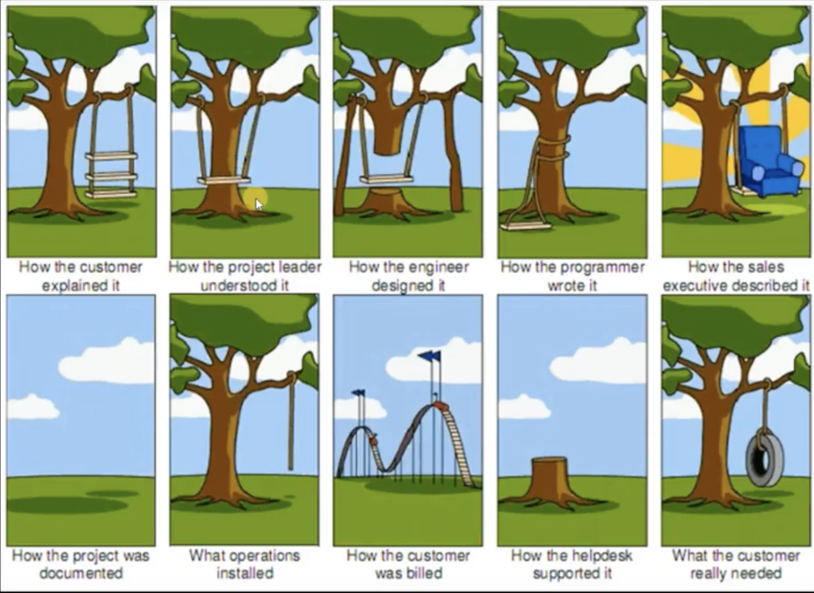

# TDD Test-Driven Development

> คิดขึ้นโดย Kent Beck

> เปลี่ยน requirement ออกมาเป็น test case เวลาทำ software ตัวหนึ่งออกมา software จะถูกเอาไป run ใน test case เรียบร้อยแล้วมีการเช็คแล้วว่า software ที่เราทำมันถูกต้องตรงกับที่ลูกค้าอยากได้ แล้วมันก็ไม่ได้ทำงานผิดพลาด

> TDD จะมาช่วยในการ design software ให้มีประสิทธิภาพและตรงกับงานของมัน และทำให้ประสิทธิภาพและความมั่นใจของทีม มีความมั่นใจที่สูงขึ้น เพราะทีมจะรู้อยู่แล้วว่า case ไหนทำได้ไม่ได้

- [1. ปัญหาที่เจอเวลาพัฒนา software ไม่ใช้หลักการ TDD](#1)
- [2. Test case เขียนยังไง](#2)

ข้อดีในการเขียน TDD

1. นักพัฒนาสามารถมองเห็นข้อผิดพลาดของโปรแกรมได้ก่อนที่จะเขียนโปรแกรม
2. น้อยลง และการแก้ bug ง่ายขึ้น
3. ระบบมีการทดสอบตลอดเวลา และ ทดสอบได้เร็วไม่ต้องรอผลเป็นวัน
4. นักพัฒนาจะส่งมอบ features ช้าในตอนแรก แต่ในระยะยาวจะเร็วกว่านักพัฒนาที่ไม่ใช้ TDD
5. ตัวระบบสามารถเพิ่ม features อื่นๆเข้าไปได้ง่ายและรวดเร็ว

The Mantra of TDD

---

## <a name="1">1. ปัญหาที่เจอเวลาพัฒนา software ไม่ใช้หลักการ TDD</a> ref: [saladpuk](https://saladpuk.gitbook.io/learn/software-testing/tdd101/intro)

- เขียน code ต่อจากคยอื่นหรือ code เดิมของตัวเองไปเจอ code อะไรก็ไม่รู้ต้องมานั่งอ่านทำความเข้าใจทีละบรรทัด
- กลับมาอ่านอีกรอบเจอ กฏหรือ security บางอย่างที่มันไม่เหมาะสมหรือไม่ปลอดภัย
- กลับมาอ่าน code ยาวๆเป็น 100 บรรทัดแล้วยังไม่รู้ว่าต้องการทำอะไร ซึ่งคิดว่าการรใส่ comment จะช่วยให้เข้าใจงายขึ้นแต่เอาจรริงๆคือไม่ได้ช่วยอะไรเลย
- ตอนที่ design program อาจจะไป design ของบางอย่างที่มันไม่เหมาะกับงาน หรือแทนที่จะได้ผลลัพแบบตรงๆกลับ design ให้มันอ้อมไปมา กว่าจะได้ผลลัพ
- product ที่ทำออกมาแล้วสุดท้ายก็ยังไม่เข้าใจว่ามันคืออะไรกันแน่ หรือ code ที่เขียนไปทั้งหมดสุดท้ายเอามารวมกันมันคืออะไรกันแน่

---

## <a name="2">2.Test case เขียนยังไง</a> ref: [saladpuk](https://saladpuk.gitbook.io/learn/software-testing/tdd101/test-cases)

> แปลงสิ่งที่ลูกค้าอยากได้ (requirement) ออกมาเป็น test case เพื่อให้ทีมกับลูกค้ามีความเข้าใจเป็นภาพๆเดียวกันก่อนว่าสิ่งที่ลูกค้าต้องการจริงๆคืออะไร

ถ้าไม่เข้าใจสิ่งที่ลูกค้าอยากได้แล้วไปพัฒนา software เลยจะเกิดอะไรขึ้น

### หลักในการคิด test case [Test-First Design](https://saladpuk.gitbook.io/learn/software-testing/test-first-design)

1. กลุ่มปรกติที่เห็นได้บ่อยๆ (Normal cases)
2. กลุ่มที่นานๆจะเจอที (Alternative cases)
3. กลุ่มที่เกิดสถานะการณ์แปลกๆในในโปรแกรม (Exception cases)

ตัวอย่างการเขียน test cases ATM ถอนเงิน

Normal cases

1. ผู้ใช้ทำการกดเงินออกจากตู้โดยข้อมูลถูกต้อง ระบบทำการหักเงินแล้วนำเงินออกมา
2. ผู้ใช้ทำการกดเงินออกจากตู้แต่เงินในบัญชีไม่พอ รระบบแจ้งเตือนข้อผิดพลาด
3. ผู้ใช้ทำการกดเงินออกจากตู้ถูกต้องแต่เงินในตู้ไม่พอจ่าย ระบบแจ้งเตือนข้อผิดพลาด

Alternative cases

1. ผู้ใช้กดเงินมากกว่าที่มีในบัญชี แต่เป็นบัญชีพิเศษ ระบบทำการหักเงินแล้วนำเงินออกมา
2. ผู้ใช้กดเงินมากกว่าที่มีในบัญชี แต่่เป็นบัญชีพิเศษและเครดิตเต็มแล้ว ระบบแจ้งเตือนข้อผิดพลาด

Exception cases

1. ผู้ใช้ถอนเงินสำเร็จแต่ระบบไม่สามารรถตัดเงินออกจากบัญชีได้ ระะบบแจ้งเตือนข้อผิดพลาด

> System under test (SUT)
> คือโค้ดที่ถูกเขียน test cases เอาไว้ทดสอบแล้ว เพื่อให้ developer มีความมั่นใจในงานที่ตัวเองเขียนว่านั้นถูกเทสแล้ว และมันสามารถเพิ่ม test cases สำหรับทดสอบ หรือ refactor มันได้ในภายหลังอีกด้วย

> actual ผลลัพจากการ run source code

> expected ค่าที่คาดหวังว่าผลลัพ(actual)จะต้องเป็นแบบนี้
